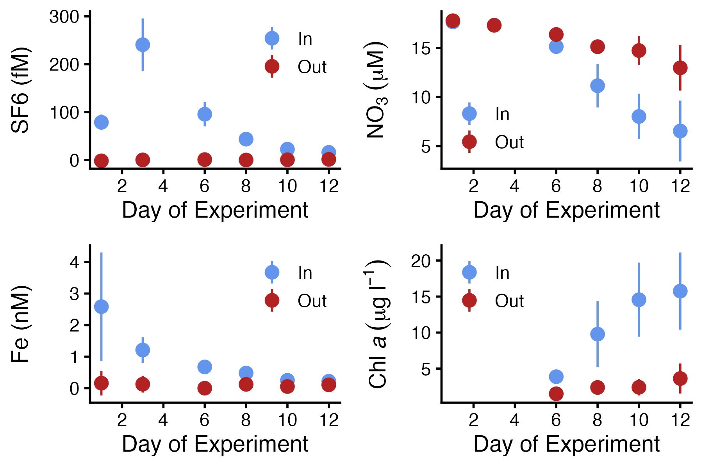

In this week's lab, you will attempt to recreate the figure below, which shows the data from the **S**ubarctic Pacific Iron **E**xperiment for **E**cosystem **D**ynamics **S**tudy (SEEDS), an iron fertilization experiment performed in the North Pacific in 2001.

{width="525"}

The data from this experiment are available in data/Underway.csv. The prompts in this lab will guide you in the steps to read the data, transform it, and create the visualization above.

## Some useful tools

These two custom functions are designed to help with this lab.

```{r}
# Fill in blanks using linear interpolation
linear_interpolate <- function(x, y) {
  mask <- !is.na(x) & !is.na(y)
  x2 <- x[mask]
  y2 <- y[mask]
  approx(x2, y2, xout = x)$y
}

# Replace a string with 0
replace_0 <- function(x, zero) {
  parse_number(ifelse(x %in% zero, 0, x))
}
```

The following functions will help you in this lab.

`paste()`

This function combines strings. For example, the following code pastes genus and species names together to form scientific names.

```{r}
genus <- c("Orcinus", "Balaenoptera", "Mirounga")
species <- c("orca", "musculus", "angustirostris")
paste(genus, species)
```

`as_date()` and `as_datetime()`

These functions create dates and datetimes, respectively. You can tell them the format to expect using %Y, %m, %d, %H, %M, and %S (representing year, month, day, hour, minute, and second. See [R4DS Ch 17](https://r4ds.hadley.nz/datetimes.html) for more details. The example below converts US-style dates and 24-hour clock times to R date and datetime objects.

```{r}
date_strings <- c("1/1/2026", "2/15/2026", "3/30/2026")
time_strings <- c("06:00:00", "12:00:00", "18:00:00")

as_date(date_strings, format = "%m/%d/%Y")
as_datetime(paste(date_strings, time_strings), format = "%m/%d/%Y %H:%M:%S")
```

`case_when()`

This function takes a series of *condition - value* pairs to create a new vector. Conditions and values are separated with the `~` symbol. The `.default` parameter handles any cases not covered by the other conditions. This example converts a vector of dog weights to "toy", "medium", and "large".

```{r}
dog_weight_lb <- c(150, 12, 28, 6, 120)
case_when(dog_weight_lb > 80 ~ "large",
          dog_weight_lb < 15 ~ "toy",
          .default = "medium")
```

## Instructions

Here's how to write up this lab. All your code should be written in a code chunk at the end of this document, following the header "Write your code here". The steps you'll need to take are described here in the section "Instructions". As you write your code, you'll solve one problem and unlock another. That mimics the real process of exploring data. That's also why you're going to put all your code in the one chunk at the end: you'll be editing it throughout the whole lab.

### Setup

Begin by loading the tidyverse and importing Underway.csv into a variable called `underway`.

### Handle dates

1.  Create a date variable called `ex_start` to hold the start date of the experiment, which was July 18, 2001.
2.  Create columns for the date and datetime of each row in `underway`.

::: callout-tip
Paste two columns together to make the datetime column.
:::

3.  Add a column called `day_of_ex` that is the number of days elapsed since the start of the experiment.

### Fix missing values

Inspect `underway`. What text do you think the authors used to represent *missing data*? Update how you import the data to account for this.

### Fix 0s written as strings

Inspect `underway` again. What text do you think the authors used to represent "too small to detect"? Replace those values using the `replace_0` function I provided you with.

### Remove outliers

Visualize the distributions of SF6, Diss_Fe, NO3, and Chl_a. There's one outlier measurement that's probably due to a device malfunction. Identify it and remove it from `underway`.

### Interpolate missing tracer values

Fill in missing values in SF6 using the `linear_interpolate` function I provided. Tip: do this in a `mutate` call. Your argument to the `x` parameter should be a datetime, and your argument to the `y` parameter should be the SF6 column.

### Identify the patch

The scientists who performed SEEDS defined "inside the patch" as "\>50% of the peak SF6 levels on that day" and "outside the patch" as "SF6 \<3 fM". Use `case_when` to create a variable called `patch` based on those conditions. `patch` should have values "Inside", "Outside", and "Edge" (the last one indicating it doesn't meet the criteria for inside or outside).

::: callout-tip
If you use `group_by` correctly, then the max of SF6 will the max of SF6 *on that day of the experiment*. Call `ungroup` after to remove the grouping.
:::

### Summarize the measurements

We'll need the mean and standard deviation of the four measurement variables on each day of the experiment, inside and outside the patch. Create a new variable called `underway_summary`, calculated by:

1.  Filter out "Edge" from the `patch` column
2.  Group appropriately
3.  Summarize each variable by mean and standard deviation
4.  Create new columns adding and subtracting the standard deviation from the mean for each measurement

### Create the plots

Review the plots at the beginning of this document. What geometries do they use? How do the aesthetics map columns of data to the scales? Replicate them as closely as you can.

As long as the data are represented accurately, you've completed the goals of this lab. If you want to get your figures to match those provided *exactly*, here are some things that will help.

::: callout-note
I haven't covered this level of plotting detail in class. You'll have to poke around in R4DS, on Google, or come to office hours to get your plots *exactly* the same.
:::

-   Set the *breaks* on your x-axis

-   Set the legend *position* and *justification* to move the legend *inside* the plot area

-   Use `expression()` and [plotmath notation](https://stat.ethz.ch/R-manual/R-devel/library/grDevices/html/plotmath.html) to create axis titles with special characters

## Write your code here

```{r}

```
